# Sistema de Autenticação e Cafeteria 🔐

Um sistema de linha de comando com autenticação e gerenciamento de consumo em uma cafeteria.
> Data: 25/03/2025  
> Autora: Luiza Kuze

## Funcionalidades

- Armazenamento seguro de senhas com hash.

- Algoritmo de hash configurável: BCrypt (padrão), PBKDF2, MessageDigest.

- Persistência genérica via CSV (substituível por banco relacional).

- Gerenciamento de usuários: registro, login, saldo, troca de senha, remoção.

- Sistema de cafeteria: compras com débito automático e registro de transações.

- Faturas por usuário: geração e listagem (com filtro por mês).

- Interface via linha de comando.

```mermaid
classDiagram
    direction TB

    %% === Models ===
    class User {
        - userId : String
        - login : String
        - hashedPassword : String
        - email : String
        - accountBalance : double
        + getUserId() : String
        + getLogin() : String
        + getHashedPassword() : String
        + getEmail() : String
        + getAccountBalance() : double
        + setHashedPassword(String) : void
        + setEmail(String) : void
        + setAccountBalance(double) : void
    }

    class CoffeeType {
        - productId : String
        - typeName : String
        - waterQty : int
        - coffeQty : int
        - milkQty : int
        - price : int
        + getId() : String
        + getName() : String
        + getPrice() : int
        + getIngredients() : Map~String, Integer~
    }

    class Invoice {
        - userId : String
        - transactionId : String
        - date : String
        - time : String
        - productId : String
        - price : double
        + getUserId() : String
        + getTransactionId() : String
        + getDate() : String
        + getTime() : String
        + getProductId() : String
        + getPrice() : double
    }

    %% === Systems ===
    class App {
        - authSystem : AuthSystem
        - coffeeSystem : CoffeeSystem
        - inVoiceSystem : InvoiceSystem
        + initializeAuthSystem() : void
        - authMenu() : void
        - coffeeMenu(userId : String) : void
    }

    class AuthSystem {
        - repository : RepositoryCSV~User~
        + register(String, String, String, double) : boolean
        + updatePassword(String, String, String) : boolean
        + authenticate(String, String) : boolean
        + getUserById(String) : User
        + getUserByLogin(String) : User
        + removeUser(String) : boolean
    }

    class CoffeeSystem {
        - repository : RepositoryCSV~CoffeeType~
        - coffeeStock : int
        - milkStock : int
        - waterStock : int
        - isWorking : boolean
        + getCoffeeMenu() : void
        + makeCoffee(coffeeTypeId : String, user : User) : boolean
        + getCoffeeByMenuNumber(number : int) : CoffeeType
        + getStatus() : String
        + getCoffeeById(cafeId : String) : CoffeeType
        + refillCoffee() : void
    }

    class InvoiceSystem {
        - repository : RepositoryCSV~Invoice~
        + addInvoice(user : User, coffeeType : CoffeeType) : void
        + history(userId : String, month : String) : boolean
    }

    %% === Repository Pattern ===
    class Repository~T~ {
        + insert(entity : T) : boolean
        + selectById(id : String) : T
        + selectAll() : List~T~
        + exists(id : String) : boolean
        + deleteById(id : String) : boolean
        + updateField(id : String, fieldName : String, newValue : String) : boolean
    }

    class RepositoryCSV~T~ {
        - fileName : String
        - type : Class~T~
        - idField : String
        + insert(entity : T) : boolean
        + selectById(id : String) : T
        + selectAll() : List~T~
        + exists(id : String) : boolean
        + deleteById(id : String) : boolean
        + updateField(id : String, fieldName : String, newValue : String) : boolean
    }

    %% === Password Hashing ===
    class PasswordHashing {
        <<interface>>
        + hash(password : String) : String
        + verify(password : String, hashed : String) : boolean
    }

    class BcryptHashing {
        + hash(password : String) : String
        + verify(password : String, hashed : String) : boolean
    }

    class Pbkdf2Hashing {
        - ITERATIONS : int
        - KEYLENGTH : int
        - salt : byte[]
        + hash(password : String) : String
        + verify(password : String, hashed : String) : boolean
    }

    class MessageDigestHashing {
        - salt : byte[]
        + hash(password : String) : String
        + verify(password : String, hashed : String) : boolean
    }

    %% === Relationships ===
    RepositoryCSV~T~ --> Repository~T~
    AuthSystem --> RepositoryCSV~User~
    CoffeeSystem --> RepositoryCSV~CoffeeType~
    InvoiceSystem --> RepositoryCSV~Invoice~
    AuthSystem --> PasswordHashing
    BcryptHashing --> PasswordHashing
    Pbkdf2Hashing --> PasswordHashing
    MessageDigestHashing --> PasswordHashing
    App --> AuthSystem
    App --> CoffeeSystem
    App --> InvoiceSystem
    InvoiceSystem --> Invoice
    CoffeeSystem --> CoffeeType
    InvoiceSystem --> CoffeeType
    App --> User
    InvoiceSystem --> User
    CoffeeSystem --> User
```
